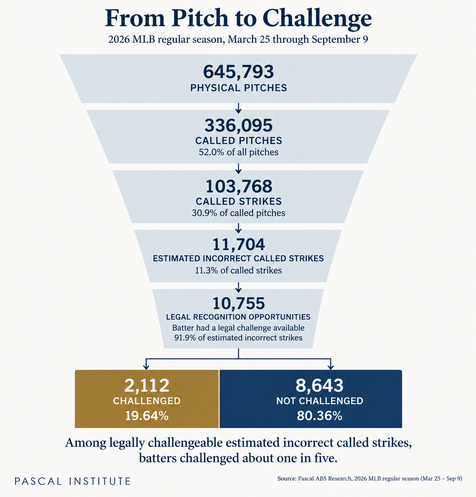
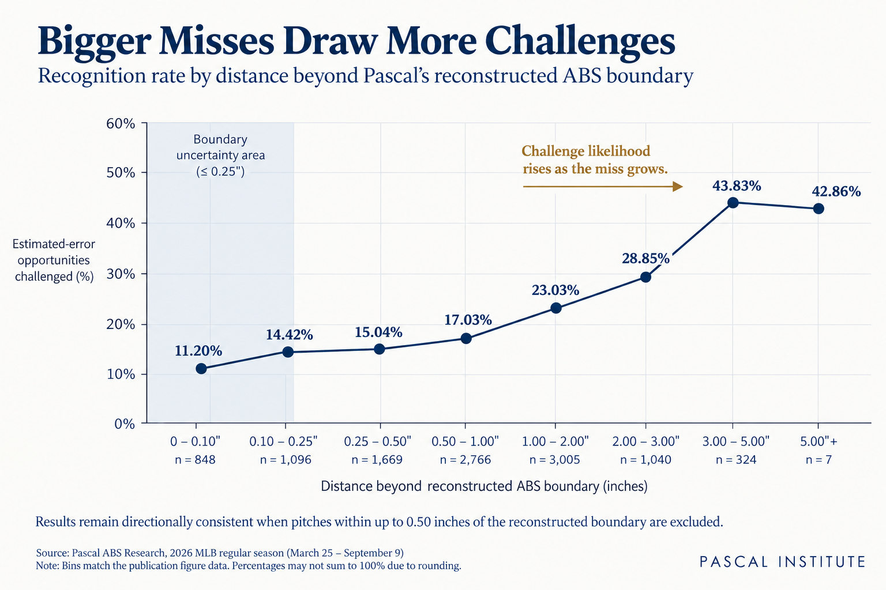
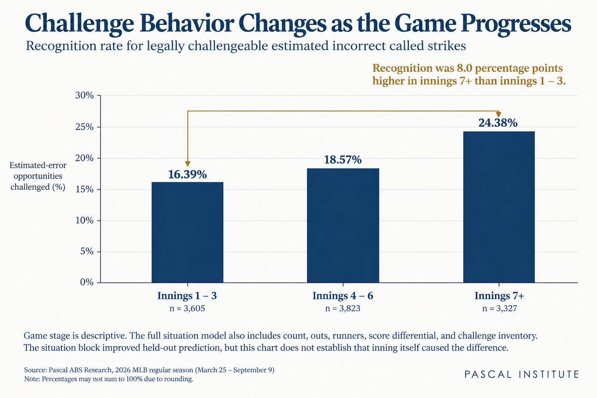

# One in Five: Inside the ABS Recognition Gap

*Pascal Institute analyzed a fixed 2026 MLB dataset to study what happens after an estimated incorrect called strike. Of 10,755 such calls where the batter had a legal challenge available, 2,112 were challenged.*

**Subject:** MLB ABS Challenge System  
**Published:** September 11, 2026  
**Analysis cutoff:** September 9, 2026  
**Method:** Public Statcast data, reconstructed ABS geometry, temporal validation  

Published at [pascalinitiative.com](https://www.pascalinitiative.com/insights/one-in-five-inside-the-abs-recognition-gap/). Methods and limits are in [methodology.md](methodology.md); the tables behind the figures are in [data/](data/).

---

Major League Baseball's Automated Ball-Strike Challenge System
changes the way an umpire's mistake can be corrected, but it does
not automatically correct that mistake. The umpire still makes the
initial call. ABS enters the process only when an eligible player
decides to challenge it.

That creates a second decision that is easy to overlook. A batter who
hears strike must decide, within seconds, whether the call was wrong and
whether that belief is strong enough to justify using one of his
team's limited challenges. The technology can provide an answer,
but only after a player decides to ask the question.

Public ABS research already examines challenge frequency, success,
missed or expected opportunities, game context, and value. We build on
that work with a fixed, independently reconstructed and validated
season-scale dataset. Starting with the full population of called
strikes, we asked what happened when our reconstructed ABS zone
identified an estimated incorrect call.

The central question became simple:

> **When an estimated incorrect called strike occurs and the batter can
          challenge, what happens next?:** 

Across our accepted 2026 season-to-date snapshot, batters challenged
2,112 of 10,755 such opportunities. That is 19.64 percent, or roughly
one in five.

## Following the Call From Pitch to Challenge

Our analysis covers MLB regular-season games from March 25 through
September 9, 2026. The fixed dataset contains 645,793 physical pitches.
From there, we followed each successive step needed to reach the
population we wanted to study: called pitches, called strikes, estimated
incorrect called strikes, calls where a legal challenge remained
available, and finally the batter's decision to challenge or hold.

The reconstructed zone classified 11,704 called strikes as estimated
incorrect calls. Of those, 10,755 occurred while the batter had a legal
challenge available. Batters challenged 2,112 and did not challenge
8,643.

*From Pitch to Challenge publication funnel*

645,793 physical pitches → 336,095 called pitches → 103,768 called
strikes → 11,704 estimated incorrect called strikes → 10,755 legal
recognition opportunities → 2,112 challenged / 8,643 not challenged.

Throughout this research, we use the word recognition in a deliberately
narrow sense. A batter recognized an estimated incorrect called strike
when he challenged it while legally able to do so. Recognition describes
an observable action. It does not tell us what the hitter saw, what he
believed, whether someone in the dugout influenced him, or why he
decided not to challenge another pitch.

That distinction also means we should not describe the remaining 8,643
pitches as errors the players "failed to notice." Some may
have been. Others may reflect uncertainty, strategy, communication, or
factors our data cannot observe. What we know is that the reconstructed
zone classified the call as incorrect, a challenge was legally
available, and no challenge was made.

## How Confident Can We Be in the Reconstruction?

Unchallenged pitches never receive an official ABS decision, so they
require an important qualification. MLB did not officially rule those
pitches incorrect. They are estimated incorrect calls based on our
reconstruction of the 2026 ABS zone using public data.

Before using that reconstruction to study unchallenged pitches, we
tested it against the population where an official answer does exist.
There were 9,485 official ABS challenges in the accepted snapshot. Our
reconstruction agreed with MLB's official decision on 9,482 of
them, a 99.968 percent agreement rate.

We preserved and audited the three disagreements rather than removing
them. We also repeated the core analysis while progressively excluding
pitches very close to the reconstructed boundary. Even after excluding
pitches within one-half inch of that boundary, the central finding
remained: most legally challengeable estimated incorrect called strikes
were not challenged. The recognition rate ranged from 19.64 percent in
the accepted population to 22.51 percent under the most conservative
boundary exclusion we tested.

That sensitivity test matters because it addresses a reasonable concern
about public tracking data. Our conclusion does not depend on treating
every pitch a few hundredths of an inch beyond the reconstructed
boundary as unquestionably wrong.

**Methodology note**  
Two of the three
official-decision disagreements were within 0.005 inches of the
reconstructed boundary. The third involved a substantial difference in
the source zone-top value. All three remain preserved in the validation
audit rather than being manually reconciled.

## Larger Misses Are Challenged More Often

The first factor we examined was the most intuitive one: how far did the
pitch miss the reconstructed ABS boundary?

The relationship was clear. As the distance beyond the boundary
increased, the probability of a challenge increased as well. That
positive association survived every boundary-uncertainty threshold in
our publication validation.

*Recognition by distance beyond reconstructed ABS boundary*

The figure is more useful than a single coefficient because it
illustrates the decision hitters actually face. An estimated miss barely
outside the boundary presents a different problem from a pitch
substantially outside it. The farther the pitch moves into the latter
category, the more frequently hitters challenge.

Geometry, however, was only part of the story.

We initially suspected that pitch characteristics might explain
additional differences in recognition. A high-velocity fastball, a
sweeper moving across the edge, and a breaking ball dropping below the
zone create very different experiences for a hitter. We therefore tested
pitch type, velocity, horizontal and vertical movement, spin, extension,
release position, and handedness.

After accounting for geometry, that group of pitch characteristics did
not add validated held-out predictive value in our accepted model. This
does not establish that movement or velocity never matters to a hitter.
It means something narrower: adding those measured characteristics did
not improve our ability to predict future challenge behavior beyond the
information already contained in the pitch geometry.

That was not the result we expected when we began the research, but null
findings are useful. The purpose of the analysis is to test plausible
explanations, not preserve them.

## The Situation Matters

Game situation produced a very different result. Adding count, outs,
runners, inning, score differential, and remaining challenge inventory
substantially improved our ability to predict whether a batter would
challenge an estimated incorrect called strike in future months.

That finding helps clarify why ABS is more than a pitch-location
problem. Consider two pitches with approximately the same relationship
to the ABS boundary. One is called strike in a relatively ordinary
early-game count. The other ends a plate appearance in a close game
late. The geometric question may be similar, but the consequences of
changing the call are not.

*Recognition by game stage*

Our results do not establish that players are using those situations
optimally. They show that situation contains substantial information
about the decision they make. Whether those decisions are good is a
separate question, and one that requires us to consider the value of the
current call against the future value of preserving the challenge.

That distinction between behavior and decision quality became
increasingly important as the project developed.

## The Batter Matters

Once we accounted for observable opportunity difficulty, batter identity
also improved prediction of future recognition behavior. In other words,
information about how a batter had behaved previously helped predict
whether he would challenge a later estimated incorrect strike.

We tested that result chronologically. Player information was estimated
from earlier games and evaluated against later ones, rather than simply
fitting a player effect to the same observations used to measure it. The
result persisted strongly enough to support a separate adjusted
batter-recognition study.

This still does not tell us that one player has better eyesight or a
superior internal sense of the strike zone. We observe the challenge
decision, not the private perceptual process behind it. What we can say
is that hitters differ in their challenge behavior in ways that remain
informative after accounting for the observable difficulty and context
of the opportunities they receive.

That will be the subject of the next article in this series.

## From Recognition to Decision Quality

The recognition analysis led naturally to a broader question. A
challenge is not simply an opportunity to correct a call. It is also a
scarce resource. An unsuccessful challenge can reduce the team's
ability to act later, while a challenge left unused has no value once
the game ends.

That turns ABS into a compact decision problem under uncertainty. The
player must consider how likely the call is to be wrong, how much
correcting it matters now, and how valuable preserving the challenge
might be later.

Our subsequent resource-management research found that challenge
exhaustion sometimes preceded later estimated errors that the team could
no longer challenge. That finding is descriptive. It does not mean the
earlier challenge was a mistake. A good decision can produce an
unfortunate outcome, just as a poor decision can occasionally work.

Later in this series, we will examine that distinction directly. The
question is not simply whether a challenge succeeded. It is whether
challenging was the better decision given what could reasonably have
been known at the time.

## Building on the ABS Research Already Underway

This study sits within a growing body of public ABS research. Baseball
Savant publishes challenge and expected-challenge metrics. MLB and
FanGraphs have examined challenge frequency, pitch location, missed
opportunities, game context, and run or win value. SABR researchers, ABS
Charts, TapToChallenge, and open-source projects have also examined the
sequential problem created by limited challenge inventory.

Pascal's contribution is narrower than claiming ownership of those
questions. We independently reconstructed and froze a 645,793-pitch 2026
MLB snapshot, validated the reconstruction against 9,485 official
decisions, reconciled the full path from physical pitches to legally
challengeable estimated errors, and tested geometry, pitch, situation,
and batter information using expanding temporal holdouts. Before
drafting this article, we also ran a separate publication-validation
process designed to challenge our boundary assumptions, terminology,
numerical claims, and differentiation from prior work.

That process changed how we describe this research. Some ideas we
initially thought might be distinctive already had substantial public
work behind them. Some hypotheses we expected to find support for did
not survive the data. The resulting claims are narrower, but they are
also easier to defend.

## What Comes Next

This article begins a continuing audit of how MLB's ABS challenge
system moves from umpire call to recognition, challenge decision,
resource use, and outcome. The goal is not to turn one dataset into as
many conclusions as possible. Each part of that sequence raises a
different question, and several deserve their own analysis.

The next installment will focus on batter recognition. Rather than
ranking players by challenge success percentage, we will ask which
hitters challenge estimated incorrect strikes more or less often than
expected given the opportunities they receive. Later articles will
examine the relative importance of geometry, pitch characteristics, and
situation, followed by the challenge as a scarce resource and the
distinction between a good decision and a good outcome.

Those studies eventually lead toward a question that sounds simple but
is considerably harder than it first appears:

> **What does it actually mean to be good at challenging ABS?:** 

Challenge success percentage cannot answer that by itself. A complete
answer has to consider which errors a player identifies, which
opportunities he passes, how much the call matters, and what he gives up
by risking a limited challenge.

For now, the first result gives us a useful place to begin. Across
10,755 legally challengeable estimated incorrect called strikes in our
accepted 2026 snapshot, batters challenged 2,112.

> **Pascal Insight:** About one in five.

## Methodology

This analysis uses Pascal Institute's accepted 2026 season-to-date ABS
research snapshot from March 25 through September 9. The reconstructed
decision environment was validated against 9,485 official ABS
challenge decisions. Unchallenged pitches never receive an official
ABS ruling, so the article uses “estimated incorrect call” for
classifications produced by the public-data reconstruction.

[Read the full methodology and validation appendix](methodology.md).

## References and prior work

1. [MLB / Baseball Savant ABS Challenges](https://baseballsavant.mlb.com/leaderboard/abs-challenges?page=0&pageSize=50&sort=n_challenges&sortDir=desc)
2. [MLB: ABS Challenge System explained](https://www.mlb.com/news/abs-challenge-system-mlb-2026)
3. [FanGraphs: An Early Nerdy Look at the Challenge System](https://blogs.fangraphs.com/an-early-nerdy-look-at-the-challenge-system/)
4. [SABR Analytics presentations](https://sabr.org/analytics/presentations)
5. [ABS Charts methodology](https://abscharts.com/writeup/methodology/)
6. [TapToChallenge](https://www.taptochallenge.com/challenges)
7. [Professor Palmer ABS challenge project](https://github.com/professorpalmer/abs-challenge)
