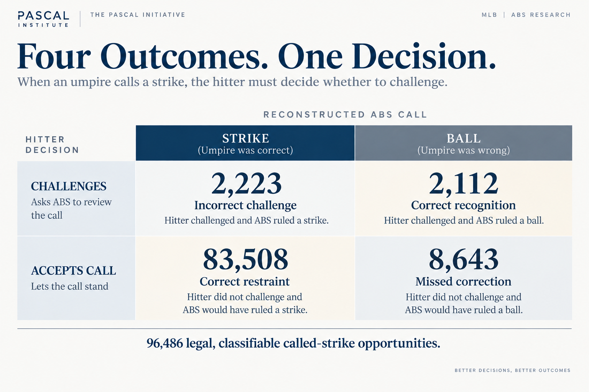
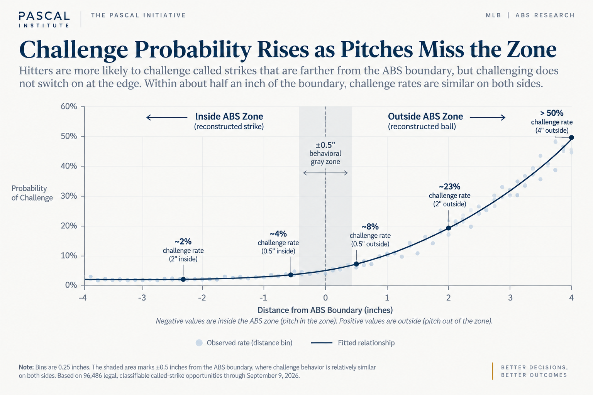
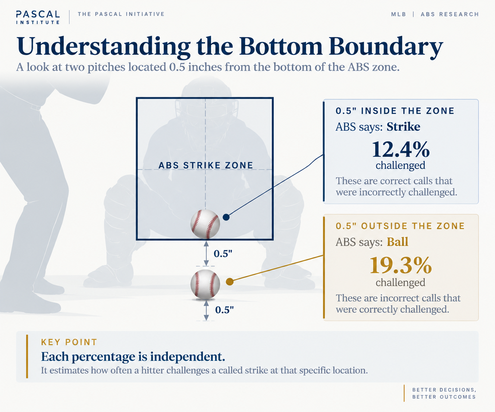
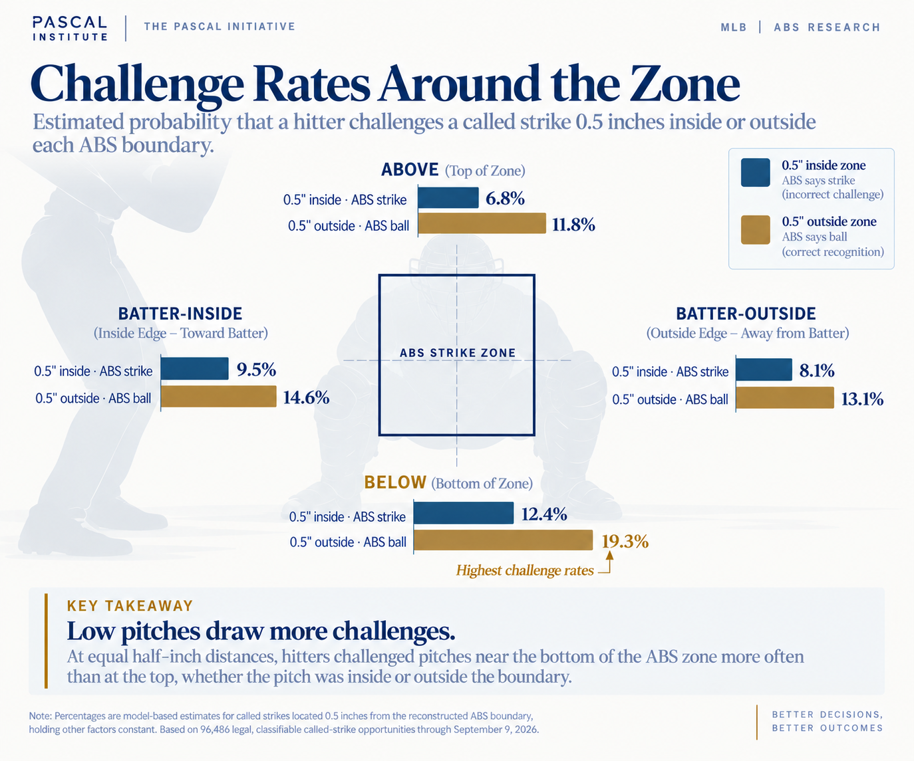

# The Challenge Threshold: What Makes a Hitter Ask ABS?

*The pitch matters. The count matters more. Across 96,486 legal called-strike opportunities, hitters challenged much more aggressively when the cost of accepting the call rose, even as challenge precision fell.*

**Subject:** MLB ABS Challenge System  
**Published:** September 2026  
**Analysis cutoff:** September 9, 2026  
**Method:** Public Statcast data, reconstructed ABS geometry, temporal validation  

Published at [pascalinitiative.com](https://www.pascalinitiative.com/insights/the-challenge-threshold/). Methods and limits are in [methodology.md](methodology.md); the tables behind the figures are in [data/](data/).

---

The ABS Challenge System gives hitters a way to correct an umpire’s
mistake. It also asks them to make a fast decision with incomplete
information and a scarce resource.

In
[the first article in this series](../01-one-in-five/README.md), we asked how often hitters challenged an estimated incorrect called
strike. Using a public-data reconstruction that agreed with 9,482 of
9,485 official ABS decisions, we found 10,755 legal opportunities
through September 9. Hitters challenged 2,112: 19.64 percent, or roughly
one in five.

That result led to a different question. Why those 2,112? What separates
a call a hitter challenges from one he allows to stand?

> **What distinguishes a called strike a hitter challenges from one he
          accepts?:** 

## Four Outcomes, One Decision

Article 1 concentrated on estimated incorrect calls. That was the right
population for measuring how frequently hitters corrected mistakes, but
it captured only one side of the decision. When an umpire calls a
strike, the hitter does not yet know what ABS will say.

For this analysis, we expanded the descriptive population to every
classifiable called strike where the hitter legally could have
challenged: 96,486 opportunities and four possible outcomes.

*Every legal, classifiable called strike ends in a challenge or an accepted call, and an ABS strike or ball.*

Among the 10,755 calls our reconstruction identified as incorrect,
hitters challenged 2,112 and allowed 8,643 to stand. Among 85,731 calls
classified as correct, hitters challenged only 2,223, or 2.59 percent.

Hitters are not challenging indiscriminately. They are generally
reluctant to challenge at all. Most called strikes are accepted,
including most incorrect ones. The useful question is what changes when
a hitter moves from accepting the umpire’s judgment to asking ABS to
review it.

## The Boundary Is Sharp. Behavior Is Not.

Pitch location is the obvious place to begin. For every opportunity, we
measured the pitch’s signed distance from the reconstructed ABS
boundary. Negative values represent pitches inside the zone; positive
values represent pitches outside it.

*Observed distance-bin rates and the fitted relationship across the reconstructed boundary. The shaded half-inch band is descriptive, not a perceptual threshold.*

As a pitch moves farther outside the zone, hitters become increasingly
likely to challenge. The more interesting behavior occurs near the
boundary itself, where challenge probability does not suddenly jump when
the technological classification changes from strike to ball. Within
about half an inch on either side, challenge behavior remains relatively
similar. We describe this cautiously as a behavioral gray zone.

This is not a measure of eyesight. We cannot observe what the hitter
saw, how confident he was, or what other information affected the
decision. The pattern could reflect perception, expectations, strategy,
or several factors working together. What we can say is that the
technological boundary is much sharper than the behavioral boundary
reflected in hitter challenges.

## Many Mistakes Are Not Borderline

If most disagreements occurred within that narrow band, the explanation
would be straightforward. The data show that they extend considerably
farther.

*Distance from the reconstructed ABS boundary. Counts were independently recalculated from the frozen pitch-level source.*

More than half of incorrect challenges occurred on pitches more than one
inch inside the reconstructed zone, and more than a quarter were over
two inches inside. The opposite error also occurred well beyond the
edge: 37.5 percent of missed corrections were over an inch outside, and
10.7 percent were over two inches outside.

Distance is important, but it is not a complete explanation. Hitters
sometimes challenge pitches meaningfully inside the zone and accept
pitches meaningfully outside it. Something besides physical distance
affects their willingness to act.

## Low Pitches Draw More Challenges

Distance alone misses another part of the geometry. Hitters do not treat
every boundary of the strike zone in the same way. The strongest
directional difference appears at the bottom.

*The two probabilities describe different pitch locations. They are independent and do not add to 100 percent.*

A pitch half an inch inside the bottom boundary is a reconstructed
strike. At that location, the publication model estimates that hitters
challenged 12.4 percent of the time. Half an inch outside the same
boundary is a reconstructed ball; the estimated challenge rate is 19.3
percent.

Applying the same comparison around the zone makes the directional
pattern easier to see.

*Estimated challenge probability at equal half-inch distances, holding the publication model’s other inputs constant.*

At equal distances, hitters were more willing to challenge low pitches
than high pitches. Half an inch outside the bottom, the estimate was
19.3 percent, compared with 11.8 percent above the zone. Half an inch
inside, the estimates were 12.4 percent at the bottom and 6.8 percent at
the top.

The horizontal differences were much smaller. We found modest evidence
of more incorrect challenging at the batter-inside edge, but no clear
difference in recognition of actual missed calls. The larger pattern is
vertical: hitters challenged low pitches more frequently on both sides
of the ABS boundary.

Why low strikes draw more skepticism remains open. Perception may
matter, but so might hitter posture, expectations about the traditional
zone, catcher presentation, prior umpire calls, coaching, or other
unmeasured factors. The defensible conclusion is behavioral: hitters are
more skeptical of low called strikes.

## Two Strikes Change the Threshold

Geometry is only part of the decision. Count provides the strongest
evidence that the consequence of accepting a call matters too. MLB’s
public expected-challenge work already includes count and game
situation. Our reconstruction lets us compare calls classified as wrong
with calls classified as correct.

*Two-strike opportunities produce much higher challenge rates on both sides of the ABS boundary.*

With fewer than two strikes, hitters challenged 16.04 percent of the
incorrect calls they encountered. With two strikes, that rose to 48.25
percent.

Correct calls show why this is not simply better recognition. With fewer
than two strikes, hitters challenged 1.70 percent of calls where ABS
says the umpire was right. With two strikes, that rose to 13.42 percent.
Hitters became about three times as likely to catch an incorrect call,
but nearly eight times as likely to challenge a correct one. Here,
challenge precision means the percentage of hitter challenges that
produced an ABS ball. It fell from 53.23 percent to 39.81 percent.

The result looks less like a sudden improvement in recognition and more
like a change in how much uncertainty a hitter will tolerate. Adding
count to pitch geometry substantially improved our ability to predict
whether a hitter would challenge, even when evaluated on held-out data.

A questionable strike on 0-0 changes the count to 0-1. A questionable
strike on 3-2 ends the plate appearance. The stakes create a reason to
act with less confidence when the alternative is accepting strike three.
This analysis does not determine whether any individual challenge was
optimal.

> **Pascal Insight:** With two strikes, hitters catch more missed calls, but with lower challenge precision. The evidence points toward a changing decision threshold.

## The Situation Around the Pitch Matters Too

**Late and close changes behavior.** Count produced the
strongest contextual result, but it was not the only one. In
late-and-close situations, defined here as the seventh inning or later
with the batting team within two runs, hitters challenged 26.69 percent
of reconstructed incorrect calls, compared with 18.31 percent otherwise.
Incorrect challenges also rose, from about 2.30 percent to 4.30 percent.

**Game context adds information.** More broadly, inning,
score, outs, runners, and related game-state variables provided
additional predictive information beyond pitch geometry and count,
although the improvement was considerably smaller than what we observed
when adding count. We do not describe this as a measured leverage effect
because the dataset does not contain a validated pre-pitch leverage
index.

**Challenge inventory may matter, but the evidence is limited.**
Adding challenge inventory to the incorrect-call model produced a small
improvement in held-out prediction, but the uncertainty interval
included no improvement. The point estimates were consistent with
greater restraint when one challenge remained, but the analysis does not
establish a distinct inventory effect, and inventory itself reflects
earlier game decisions.

**Pitch characteristics did not improve held-out prediction.**
Adding velocity, movement, spin, extension, release position, pitch
family, and throwing hand to the selected baseline did not provide
reliable additional predictive information once geometry and situation
were known. That does not establish that those characteristics have no
effect on perception. It tells us only that the group of pitch
characteristics we tested did not materially improve prediction.

## A Good Decision Is Not the Same as a Good Outcome

An unsuccessful challenge is not necessarily a poor decision. Agreement
with ABS and decision quality are different things. A questionable 3-2
strike may be worth challenging even when the hitter is far from certain
he will win.

That distinction echoes the decision principle Annie Duke develops in
*Thinking in Bets*: outcomes contain information, but they are
not sufficient to judge the quality of the choice that produced them.
Our analysis can tell us whether a hitter’s decision agreed with
official or reconstructed ABS. It cannot yet tell us whether the
decision was worth making.

Article 1 showed that hitters challenged only about one in five
estimated incorrect called strikes. Article 2 shows that which calls
they challenge depends on more than whether the pitch was outside the
zone. Evidence from the pitch, the consequence of doing nothing, and
possibly the scarcity of the challenge all help shape the threshold.

[Article 3 asks the next question](../03-who-sees-the-miss/README.md): after accounting for how recognizable a missed call was, does the
identity and prior behavior of the hitter still tell us something about
what he will do next? That lets us test whether the same evidence
produces meaningfully different responses from different people.

> **The call shapes the challenge threshold. Does the person making the
          decision add another signal?:** 

## Methodology

This analysis uses Pascal Institute’s frozen 2026 season-to-date
snapshot from March 25 through September 9: 2,195 completed
regular-season games and 645,793 physical pitches. The Article 2
descriptive universe contains 96,486 legal, classifiable called-strike
opportunities. Unchallenged pitches receive no official ABS ruling, so
their ball-or-strike labels come from Pascal’s public-data
reconstruction; challenged pitches use the official result.

**Reconstruction validation:** 9,482 of 9,485 official
decisions agreed (99.968%). All three disagreements remain in the
audit.

**Primary modeled population:** 10,755 reconstructed
incorrect called strikes with a legal hitter challenge; 2,112 were
challenged.

**Two-sided publication model:** A separate descriptive
logistic model used all 96,486 legal, classifiable opportunities to
estimate challenge behavior on both sides of the ABS boundary.

**Temporal evaluation:** March–June training, July model
selection, August 1–September 9 final test (n=2,830).

**Interpretation:** Descriptive and predictive
associations only. No claim measures eyesight, private confidence,
causality, or optimal strategy.

The two-sided distance and boundary figures come from the descriptive
publication model, whose outcome is whether the hitter challenged. It
models signed boundary distance flexibly and includes boundary
direction, batter handedness, count, inning, score, outs, base state,
and remaining challenge inventory. For each half-inch comparison, we
set the pitch location to 0.5 inches inside or outside the named
boundary for every opportunity, retained the observed values of the
other inputs, and averaged the resulting predicted probabilities. The
estimates therefore compare standardized locations; they are not raw
cell percentages, causal effects, or direct measures of perception.
This full-sample descriptive model is separate from the temporally
evaluated incorrect-call model summarized below.

The fixed logistic progression added geometry, count, game context,
inventory, and one prespecified pitch-characteristic block. Processing
and imputation were fit only on training data. Paired bootstrap
intervals were calculated separately with game and batter clustering.
Boundary sensitivity excluded pitches within 0.05, 0.10, 0.25, and
0.50 inches and preserved the main distance and count findings.

[Read the full Article 2 methodology, validation results,
definitions, and numerical audit](methodology.md).

## References and prior work

1. [Pascal Institute: One in Five - Inside the ABS Recognition Gap](../01-one-in-five/README.md)
2. [MLB / Baseball Savant ABS Challenges](https://baseballsavant.mlb.com/leaderboard/abs-challenges)
3. [MLB / Baseball Savant ABS Metrics Documentation](https://baseballsavant.mlb.com/abs-metrics-documentation)
4. [MLB: ABS Challenge System explained](https://www.mlb.com/news/abs-challenge-system-mlb-2026)
5. [FanGraphs: An Early Nerdy Look at the Challenge System](https://blogs.fangraphs.com/an-early-nerdy-look-at-the-challenge-system/)
6. [Annie Duke, *Thinking in Bets*](https://www.penguinrandomhouse.com/books/552885/thinking-in-bets-by-annie-duke/)
