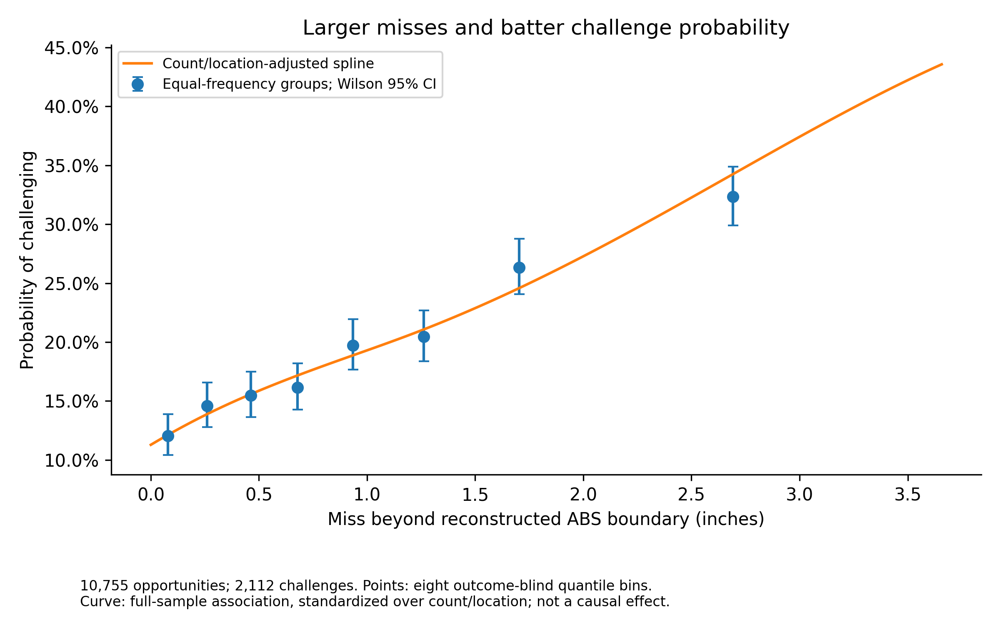
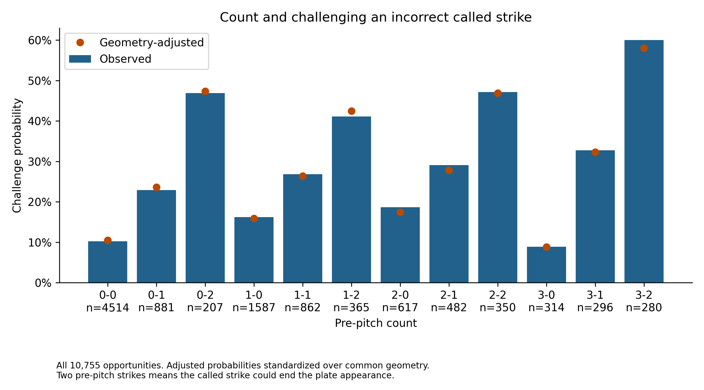
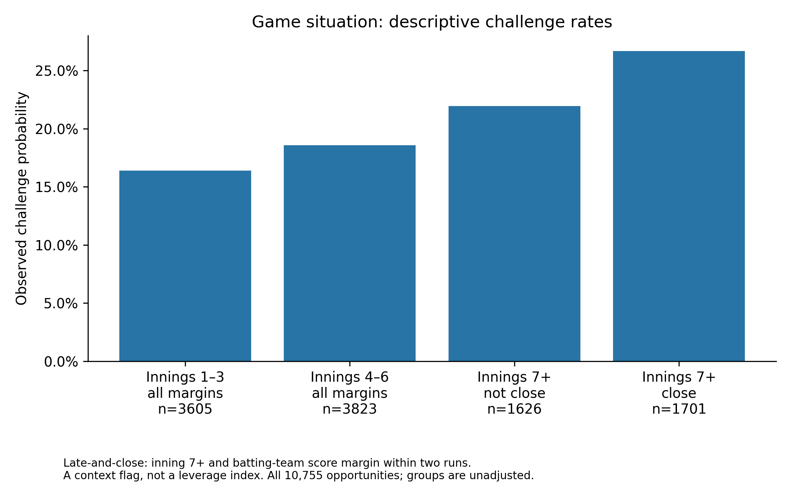
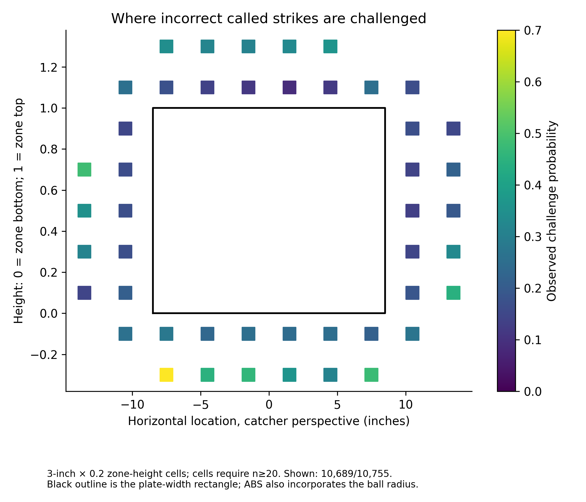
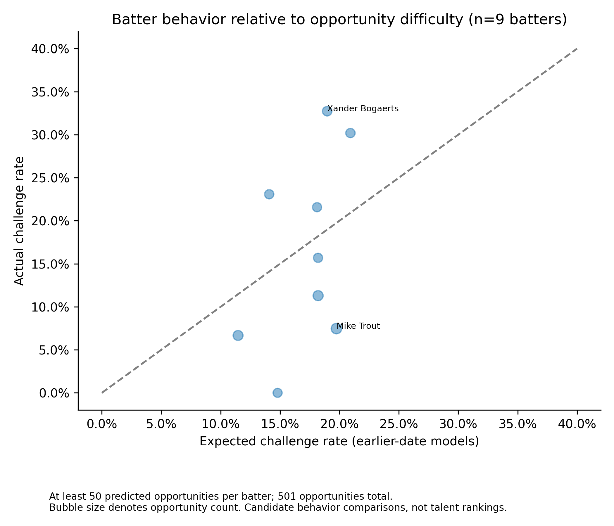
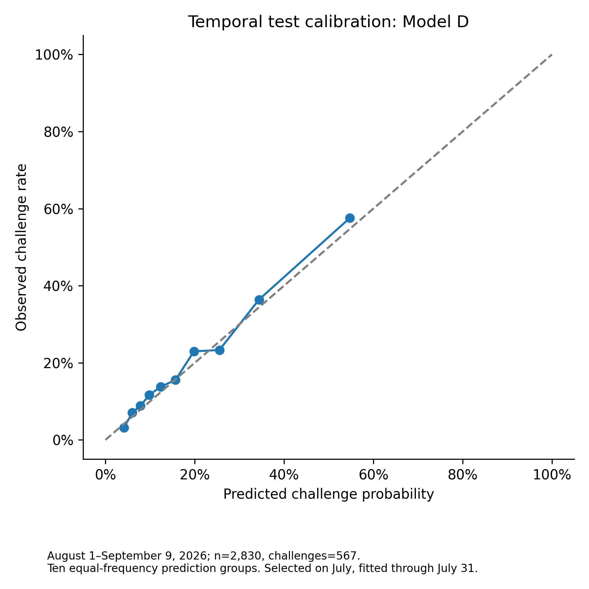
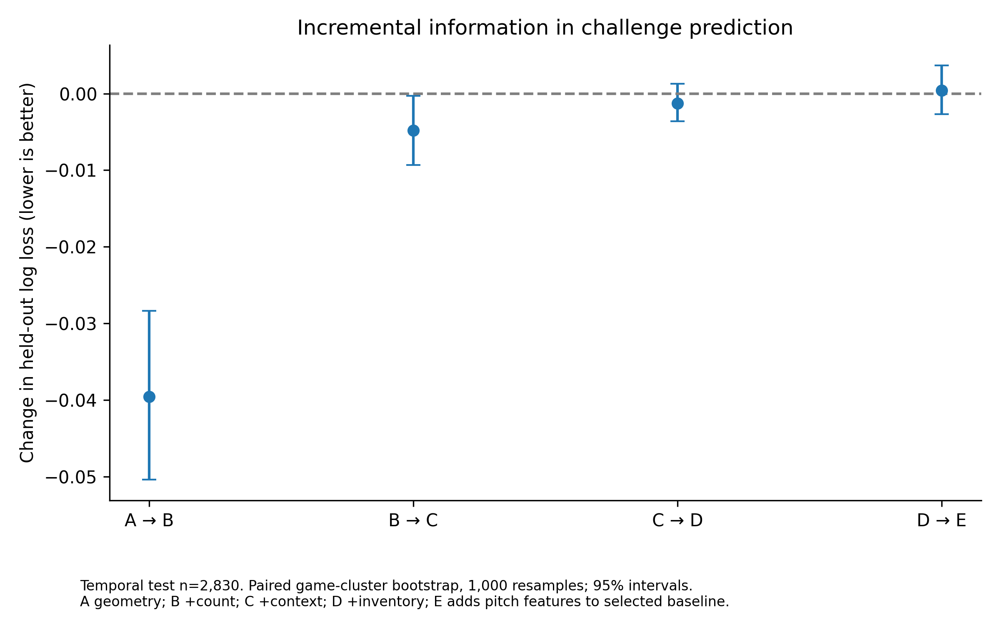

# Article 2 analytical figures

### 01_distance

10,755 opportunities; 2,112 challenges. Points: eight outcome-blind quantile bins.
Curve: full-sample association, standardized over count/location; not a causal effect.

### 02_count

All 10,755 opportunities. Adjusted probabilities standardized over common geometry.
Two pre-pitch strikes means the called strike could end the plate appearance.

### 03_situation

Late-and-close: inning 7+ and batting-team score margin within two runs.
A context flag, not a leverage index. All 10,755 opportunities; groups are unadjusted.

### 04_location

3-inch × 0.2 zone-height cells; cells require n≥20. Shown: 10,689/10,755.
Black outline is the plate-width rectangle; ABS also incorporates the ball radius.

### 05_batters

At least 50 predicted opportunities per batter; 501 opportunities total.
Bubble size denotes opportunity count. Candidate behavior comparisons, not talent rankings.

### 06_calibration

August 1–September 9, 2026; n=2,830, challenges=567.
Ten equal-frequency prediction groups. Selected on July, fitted through July 31.

### 07_increment

Temporal test n=2,830. Paired game-cluster bootstrap, 1,000 resamples; 95% intervals.
A geometry; B +count; C +context; D +inventory; E adds pitch features to selected baseline.

