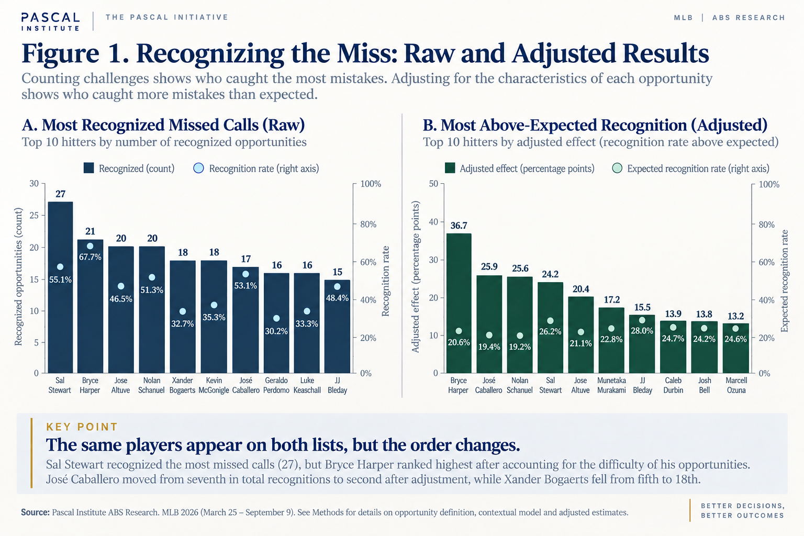
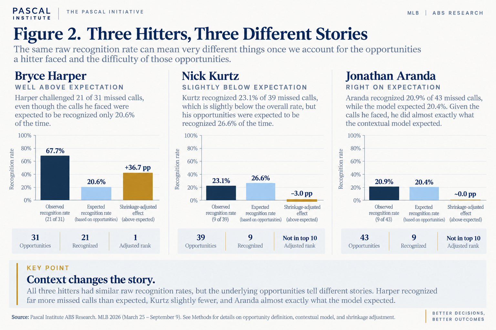
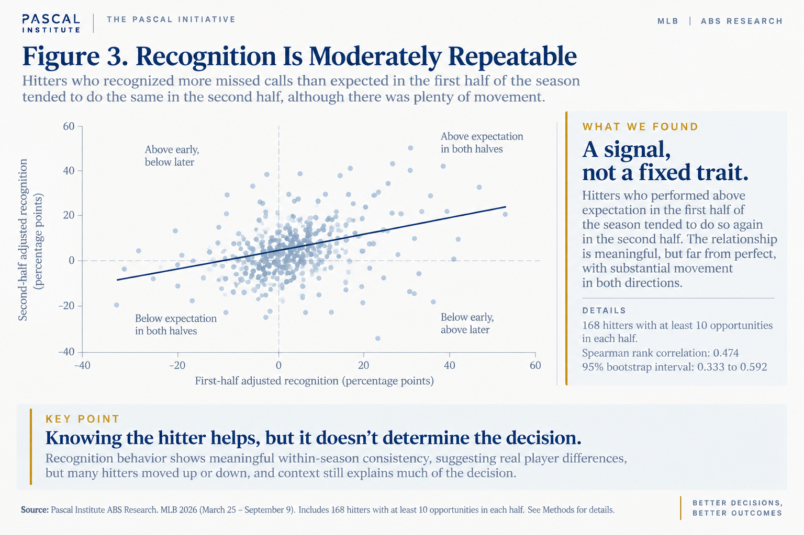

# Who Sees the Miss?

*What the ABS challenge system is teaching us about the hitter making the decision.*

**Subject:** MLB ABS Challenge System  
**Published:** September 2026  
**Analysis cutoff:** September 9, 2026  
**Method:** Context adjustment, partial pooling, temporal validation  

Published at [pascalinitiative.com](https://www.pascalinitiative.com/insights/who-sees-the-miss/). Methods and limits are in [methodology.md](methodology.md); the tables behind the figures are in [data/](data/).

---

Bryce Harper had 31 chances to challenge an incorrect called strike through September 9. He challenged 21 of them.

That means Harper recognized and acted on 67.7 percent of the missed calls available to him, compared with 19.6 percent across the 10,755 eligible opportunities in our study.

That is the kind of number that makes you want to build a leaderboard. Put every hitter in a column, calculate a percentage and see who is best. There is just one problem: our previous ABS research showed that the comparison would not be fair. Some missed calls are much easier to recognize than others. A pitch well outside the ABS boundary presents a different problem than one that misses by a fraction of an inch, and [The Challenge Threshold](../02-the-challenge-threshold/README.md) showed that count and game situation also affect whether a hitter acts.

So Harper’s 67.7 percent raised a more interesting question. Was he unusually good at recognizing missed calls, or did he simply get a collection of calls that were easier to challenge?

> **After accounting for how recognizable an incorrect called strike was, does a hitter’s history still tell us anything about what he will do next?:** 

## Who Catches the Mistakes?

Before adjusting anything, we started with the simplest possible measure: who actually caught the most mistakes? Sal Stewart led our study with 27 challenges of eligible incorrect called strikes. Harper was second with 21, while Jose Altuve and Nolan Schanuel each had 20.

| Hitter | Opportunities | Recognized | Recognition rate | Expected rate | Adjusted rank |
| --- | --- | --- | --- | --- | --- |
| Sal Stewart | 49 | 27 | 55.1% | 26.2% | 4 |
| Bryce Harper | 31 | 21 | 67.7% | 20.6% | 1 |
| Jose Altuve | 43 | 20 | 46.5% | 21.1% | 5 |
| Nolan Schanuel | 39 | 20 | 51.3% | 19.2% | 3 |
| Xander Bogaerts | 55 | 18 | 32.7% | 21.4% | 18 |
| Kevin McGonigle | 51 | 18 | 35.3% | 23.1% | 13 |
| José Caballero | 32 | 17 | 53.1% | 19.4% | 2 |
| Geraldo Perdomo | 53 | 16 | 30.2% | 21.0% | 25 |
| Luke Keaschall | 48 | 16 | 33.3% | 21.1% | 14 |
| JJ Bleday | 31 | 15 | 48.4% | 28.0% | 7 |

JJ Bleday and Caleb Durbin tied at 15 recognized opportunities. Bleday is shown because this display uses batter ID as a neutral tie-break.

Even this simple table starts to show why counting challenges is not enough. Stewart had 18 more opportunities than Harper. Bogaerts had 55 opportunities, the most among anyone on this list, while Caballero had only 32. More opportunities create more chances to catch mistakes, and the difficulty of those opportunities varies as well.

We estimated how often each missed call would be expected to draw a challenge based on the characteristics of the opportunity, without considering the hitter. That gave us a contextual expectation for every player. A hitter who received a collection of obvious misses should be expected to recognize more of them. A hitter whose opportunities were closer to the boundary or came in situations where challenges were less common should be expected to recognize fewer.

Once we account for those differences, the two lists still resemble one another, but they are no longer the same. Harper moves from second in total recognitions to the highest adjusted estimate. Caballero moves from seventh to second. Bogaerts, despite tying for fifth in recognized calls, falls to 18th after adjustment. Perdomo moves from eighth to 25th.

That movement is the point. Challenge totals tell us who caught the most mistakes. The adjusted results ask a different question: Who caught more mistakes than we would have expected from the opportunities they were given?

*Raw recognition volume and contextual adjustment answer different questions. Adjusted ranks are point estimates, not proof that adjacent players are meaningfully separated.*

The adjusted order needs restraint. Harper had the highest point estimate, but that does not give us enough evidence to declare him definitively the best ABS recognizer in baseball. There is uncertainty around every player’s estimate, and many of those ranges overlap. The order is useful for showing who stood out, not for pretending we can precisely separate neighboring positions.

## Does It Follow the Hitter?

There is an easy way to create an impressive-looking player ranking: use everything that happened during the season to explain everything that happened during the season. That can describe the past very well without telling us whether we have discovered anything repeatable.

We wanted a harder test. We used what a hitter had done on earlier opportunities and asked whether that information improved our predictions when he faced missed calls later. The model already knew about the pitch geometry and situation. The only new information was the hitter’s previous recognition behavior.

It helped. The improvement was modest, but it appeared across each of the primary measures we used to evaluate future predictions. Knowing the hitter’s history told us something that the characteristics of the call alone did not. This was not simply a ranking built after the season had happened. Earlier behavior contained information about later behavior.

## Three Hitters, Three Different Stories

Harper’s raw numbers looked extraordinary, and accounting for his opportunities did not explain them away. He challenged 21 of 31 missed calls even though the calls he faced carried an expected recognition rate of only 20.6 percent.

Nick Kurtz presents a different story. His 23.1 percent raw recognition rate was slightly above the overall rate in our study, but the opportunities he faced were expected to be recognized 26.6 percent of the time. Once context was considered, his result was close to expectation and slightly below it. Jonathan Aranda landed almost exactly where the contextual model expected: 20.9 percent observed compared with 20.4 percent expected.

*Three accepted case studies show why a raw rate and a shrinkage-adjusted estimate can tell different stories.*

That is why we are reluctant to call this simply a challenge-rate leaderboard. The same raw percentage can mean different things depending on the decisions a hitter actually faced, and a hitter’s history appears to carry some information after those differences are accounted for.

## Recognition Is Moderately Repeatable

We tested the same idea another way by dividing the season into ordered halves. If the player differences were mostly noise, the hitters who finished above expectation early should have scattered much more randomly later.

Instead, hitters who performed better than expected in the first half tended to do so again in the second half. The relationship was moderate, with a rank correlation of 0.474, and there was still plenty of movement from one period to the next.

*Adjusted recognition showed moderate within-season repeatability, not a fixed or permanent trait.*

That combination is important. The results are consistent with a repeatable component of recognition behavior, but there is substantial movement from one period to the next. We have one season of evidence showing moderate within-season repeatability, not a fixed player trait. We do not know whether the same hitters will stand out next year, and we do not know what underlying characteristic, or combination of characteristics, creates the effect.

## Where the Difference Appears

The most interesting part of the study may not be who finished first. It may be where knowing the hitter helped.

We separated missed calls by their distance from the reconstructed ABS boundary. The hitter signal was strongest on moderate misses, those more than half an inch but no more than two inches outside the boundary. On obvious misses beyond two inches, hitter history added essentially no predictive improvement, but that subgroup contained only seven hitters with adequate support. That sparse sample prevents a strong conclusion that no player differences exist on obvious misses.

That pattern makes intuitive sense, but we need to be careful about what the data actually establish. We did not measure what a hitter saw or how certain he felt. Still, it raises an interesting possibility: when the evidence is overwhelming, there may not be much left for individual differences to explain. A pitch several inches outside the boundary gives everyone a strong signal. The more interesting differences emerge in the middle, where the call is wrong but the answer may require more judgment.

Decisions are often most revealing near a threshold. When evidence is overwhelming, people tend to arrive at the same conclusion. When the evidence is weaker, individual history, judgment and interpretation have more room to matter. Our results do not tell us which of those mechanisms explains the batter effect, but they show that the effect is most informative in exactly that middle ground.

## What We Can, and Cannot, Conclude

It would be tempting to take the next step and ask what Harper or Caballero is doing differently. Maybe some hitters see the zone better. Maybe plate discipline carries over into challenge recognition. Experience, preparation, coaching, confidence or communication from the dugout could all play a role. There may also be important characteristics of these opportunities that our model does not capture.

We do not have evidence to choose among those explanations. In fact, even the word recognition requires some care because what we observe is an action. A hitter can believe a call was wrong and still decide not to challenge it. He may not feel certain enough, he may value preserving the challenge, or someone else may influence the decision. Our data tell us whether the hitter acted on an incorrect call, not exactly what he perceived in the moment.

That is why we prefer to describe this as recognition behavior rather than declaring that we have measured a new baseball skill. The distinction does not weaken the finding. Historical hitter behavior still improved future prediction, and the differences showed moderate repeatability within the season. It simply keeps the conclusion tied to what we actually observed.

We also chose not to publish a list of the lowest-ranked hitters. Negative estimates exist, but a one-season result with overlapping uncertainty is not a good foundation for labeling someone a poor recognizer. The interesting finding is not that we can sort every hitter from best to worst. It is that after accounting for the calls themselves, measurable differences between hitters remain.

> **Pascal Insight:** Historical hitter recognition behavior contains information about future recognition beyond the measured characteristics of the opportunity. The signal is moderate and behavioral, not a causal measure of eyesight or a permanent trait.

## The Person Making the Decision

This ABS series began with a surprisingly large gap. Hitters challenged fewer than one in five incorrect called strikes they were eligible to challenge. [The Challenge Threshold](../02-the-challenge-threshold/README.md) helped explain that gap by showing that the call itself matters. A larger miss is easier to recognize, and the circumstances surrounding the pitch can change whether a hitter acts.

Now we can add another piece. The same evidence does not produce exactly the same response from everyone. After accounting for what we could measure about the call and situation, knowing how a hitter had responded before still modestly improved our ability to predict what he would do next. The effect was most informative not when the mistake was obvious, but in the middle ground where the decision carried more ambiguity.

That may be the most interesting lesson from the ABS challenge system so far. Better decisions are not determined by information alone. They emerge from the interaction between the evidence, the circumstances and the person interpreting both.

Baseball gives us a way to watch that interaction happen one pitch at a time.

## Methodology

This study uses the same frozen ABS research population from March 25 through September 9, 2026: 10,755 incorrect called strikes that met the legal challenge-opportunity definition, of which 2,112 were challenged.

**Prospective comparison:** The accepted opportunity model was compared with a second model using only point-in-time-safe hitter history.

**Final holdout:** August 1 through September 9: log loss improved from 0.4303 to 0.4176, Brier score from 0.1360 to 0.1314, and ROC AUC from 0.7540 to 0.7729.

**Small-sample protection:** Empirical-Bayes partial pooling; 20 opportunities for publication and 30 for adjusted ranking.

**Temporal stability:** 168 hitters with at least 10 opportunities in each half; Spearman 0.474, with a 95% bootstrap interval from 0.333 to 0.592.

**Interpretation:** Predictive behavioral differences only. No claim identifies perception, causation, innate ability, or multi-season persistence.

[Read the full Article 3 methodology, validation design, support rules, sensitivity results, and interpretive limits](methodology.md).

## References and prior work

1. [Pascal Institute: One in Five: Inside the ABS Recognition Gap](../01-one-in-five/README.md)
2. [Pascal Institute: The Challenge Threshold](../02-the-challenge-threshold/README.md)
3. [MLB / Baseball Savant ABS Challenges](https://baseballsavant.mlb.com/leaderboard/abs-challenges)
4. [MLB / Baseball Savant ABS Metrics Documentation](https://baseballsavant.mlb.com/abs-metrics-documentation)
5. [FanGraphs: Who’s Getting Their Money’s Worth From the ABS Challenge System?](https://blogs.fangraphs.com/whos-getting-their-moneys-worth-from-the-abs-challenge-system/)
6. [SABR Analytics Conference research presentations](https://sabr.org/analytics/presentations)
