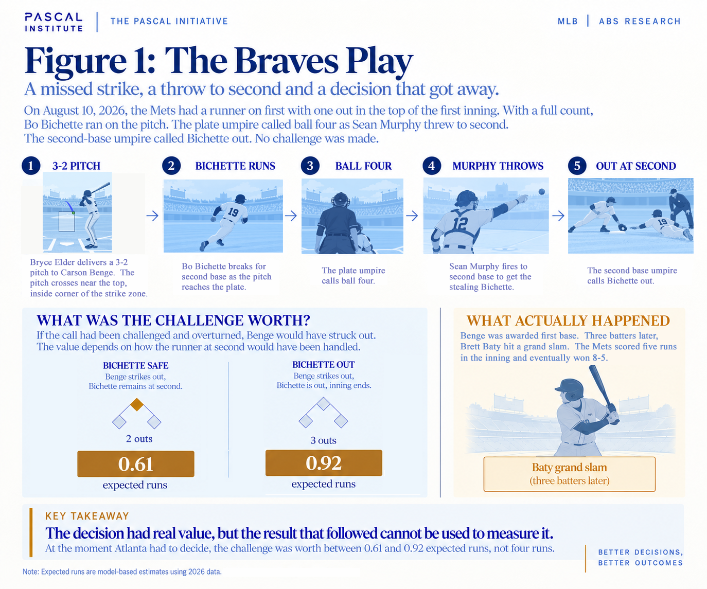
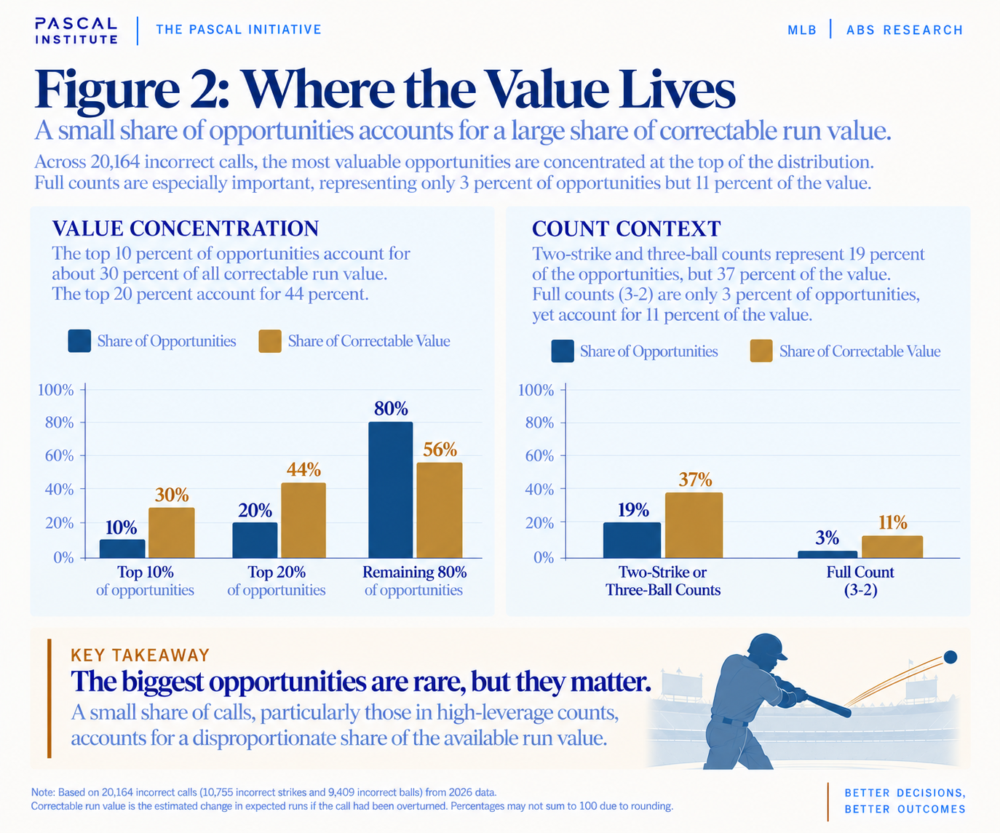
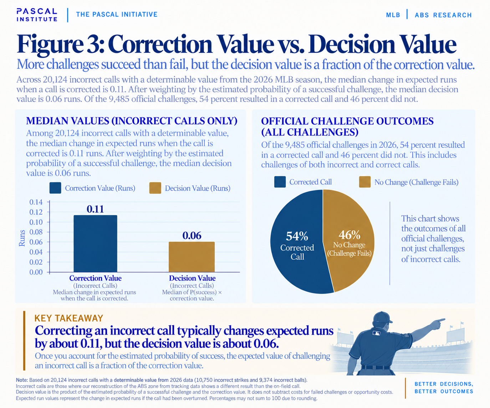
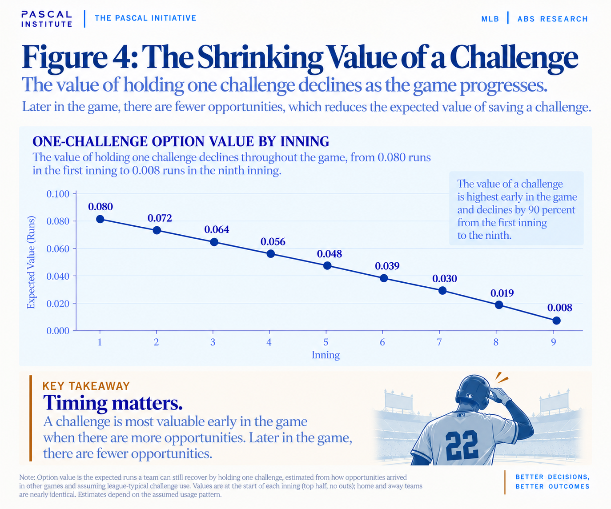
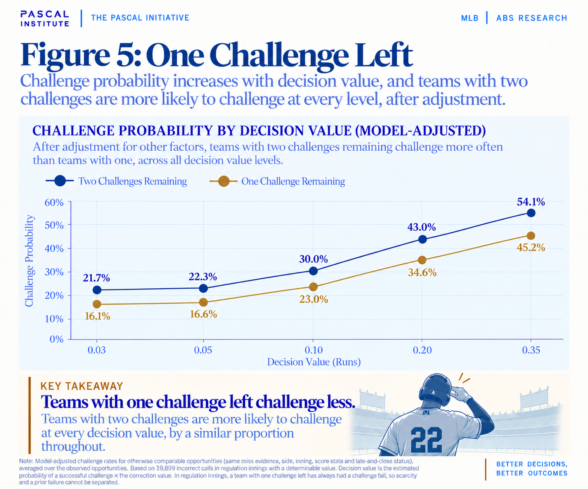
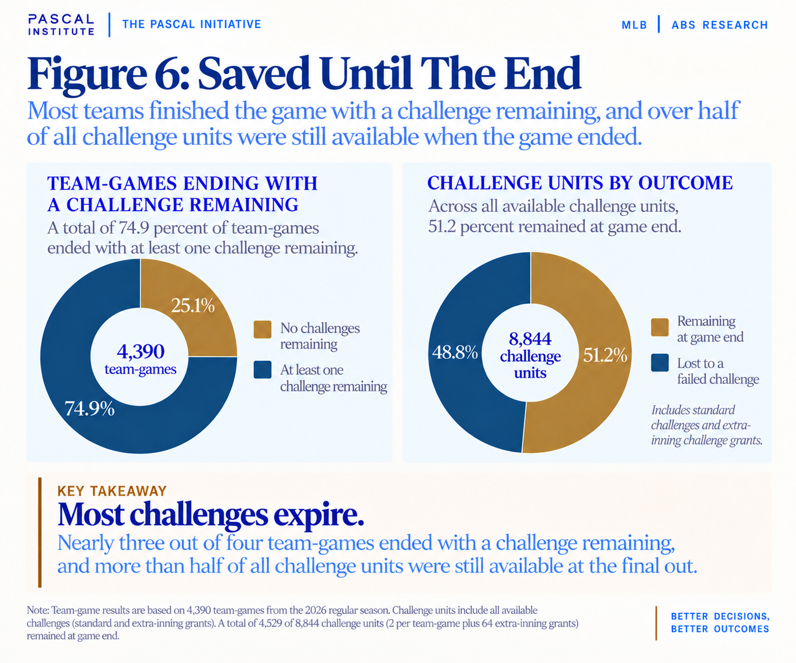

# What Is a Challenge Worth?

*The value of correcting a call, the cost of being wrong and the danger of saving a challenge for an opportunity that may never arrive.*

**Subject:** MLB ABS Challenge System  
**Published:** September 2026  
**Data:** 20,164 incorrect calls from the 2026 season  
**Method:** Expected run value, decision value and challenge option value  

Published at [pascalinitiative.com](https://www.pascalinitiative.com/insights/what-is-a-challenge-worth/). Methods and limits are in [methodology.md](methodology.md); the tables behind the figures are in [data/](data/).

---

On August 10, the New York Mets were playing the Atlanta Braves at
Truist Park when an unusual sequence unfolded in the top of the first
inning.

At the time, there was little reason to believe the play would become
significant. The game had barely started, the Mets had only one runner
on base, and the Braves had both of their ABS challenges available.

Bo Bichette stood on first base with one out while Carson Benge faced
Braves starting pitcher Bryce Elder. The count eventually reached three
balls and two strikes. With the count full, Bichette took off for second
as Elder delivered the pitch. Braves catcher Sean Murphy received the
ball near the top of the strike zone and immediately came out of his
crouch. His attention turned to Bichette, who was racing toward second.
Murphy transferred the ball from his mitt and fired a throw to second
base. The throw beat Bichette, and the second-base umpire called him
out. At nearly the same time, the home plate umpire called Elder’s pitch
ball four.

**The pitch was actually a strike.**

The pitch was up and in to the left-handed Benge, and by the ABS zone it
was likely a strike with room to spare. It would have had to be about
2.7 inches farther out to miss the zone entirely, nearly the diameter of
a baseball. Had Atlanta successfully challenged the call, Benge would
have struck out. Instead, ball four stood, Benge was awarded first base,
and Bichette was entitled to second. No challenge was made.

[Video of the play](https://www.mlb.com/braves/video/braves-miss-abs-opportunity-on-walk)
clearly shows Murphy made the throw and the second-base umpire called
Bichette out, but the ball-four call ultimately made the play at second
irrelevant.

Of course what the video does not show, nor does StatCAST tell us, is
why Atlanta failed to challenge. Perhaps Murphy was too occupied with
the play at second to immediately process the location of the pitch.
Perhaps he was unsure whether the pitch had actually caught the zone.
Perhaps the challenge window simply disappeared while the play was
unfolding. The video can show us what happened, but it cannot tell us
what Murphy was thinking.

What happened next makes the missed opportunity much easier to remember.
The Mets eventually loaded the bases, and three batters after Benge’s
walk, Brett Baty hit a grand slam. By the time the Braves finally
escaped the inning, New York had scored five runs. The Mets eventually
won the game 8-5.

Knowing what happened afterward makes it tempting to assign enormous
importance to the missed challenge. If Atlanta challenges the pitch and
wins, Benge strikes out. Depending on how the play at second would have
been handled, the Braves might have recorded the second out or completed
what amounted to an inning-ending strikeout and caught stealing. There
would have been no Baty grand slam. It would be easy to conclude the
missed challenge cost Atlanta four runs. It would also be wrong.

At the moment the Braves had to decide whether to challenge, Baty’s
grand slam had not happened. Nobody knew the bases would eventually
become loaded, and nobody knew what Baty would do when he came to the
plate. Using those later events to evaluate the earlier decision gives
Atlanta information it could not possibly have possessed. The better
question is not how many runs scored afterward. The better question is
how much the challenge was worth when Atlanta had the opportunity to
make it.

Depending on how the runner at second would have been handled,
correcting the call was worth somewhere between 0.61 and 0.92 expected
runs to Atlanta. That is a significant amount for a single pitch in the
first inning, but it is still a long way from four runs. The difference
between those two numbers, the expected value when the decision was made
and the result that followed, is where the fourth part of our ABS
investigation begins.

*The challenge was worth between 0.61 and 0.92 expected runs when Atlanta had to decide. The grand slam three batters later was the realized result, not the decision-time value.*

## Putting a Value on the Call

The first three articles in our ABS series focused primarily on
recognition. We started by examining how often hitters challenged
incorrect strikes and discovered that they did so less than one time in
five. From there, we looked at the characteristics of the pitch and
found that some incorrect calls are much easier to identify than others.
In the third article, we found evidence that the hitter also matters.
Some hitters challenged incorrect calls more often than expected, even
after accounting for the opportunities they faced.

Those findings left another possibility to consider. A player might
believe a call was wrong and still decide not to challenge. Under the
ABS system, challenges are a limited resource. If a challenge is
successful, the team keeps it. If the challenge fails, one of the team’s
challenges is lost. A player who believes an umpire missed a pitch must
therefore make two judgments. He has to decide whether the call was
probably wrong, but he also has to decide whether he is confident enough
to risk something his team may need later.

To investigate that question, we had to expand our research beyond
hitters. Challenges belong to the team, not to the offense. A challenge
saved by a hitter in the third inning may be used by a catcher to
contest a ball in the seventh. We identified 10,755 incorrect strikes
that created offensive challenge opportunities and another 9,409
incorrect balls that created defensive opportunities. In total, that
gave us 20,164 incorrect calls to examine.

For each call, we reconstructed two versions of what happened. The first
was the game state created by the umpire’s actual call. The second was
the game state that would have existed if the call had been corrected.
By comparing the two, we could estimate how many runs the correction was
worth before knowing what happened on any later pitch.

One of the first things that became apparent was that incorrect calls do
not have equal value. Consider two pitches that miss by exactly the same
amount. The first comes with nobody on base and a 1-0 count. Correcting
the call changes the count, but the plate appearance continues. The
second comes on a 3-2 count. Depending on the runners and outs,
correcting that call can turn a walk into a strikeout and dramatically
change the inning. The umpire may have made essentially the same
physical mistake on both pitches, but the consequences are very
different.

Across the 20,164 incorrect calls in our study, correcting a call was
worth an average of about 0.15 expected runs. Half of the opportunities
were worth less than approximately 0.11 runs and half were worth more.
The most valuable 10 percent of opportunities accounted for about 30
percent of all the available run value, while the top 20 percent
accounted for 44 percent.

Counts near the end of a plate appearance were particularly important.
Two-strike and three-ball counts represented only 19 percent of the
incorrect calls in our study, but they accounted for 37 percent of the
available value. Full counts were even more striking. Only about 3
percent of the opportunities occurred with a 3-2 count, yet those
pitches represented roughly 11 percent of all correctable run value.

The reason is familiar to anyone who has watched much baseball. A missed
call early in the count usually changes the count. A missed call late in
the count can change who is still batting, who reaches base, how many
outs there are, and whether the inning continues. The location of the
pitch tells us how wrong the call was. The situation tells us how much
the mistake mattered.

*A small share of calls, particularly those in high-consequence counts, accounts for a disproportionate share of the correctable run value.*

## The Cost of Being Wrong

When we added the value of all 20,164 incorrect calls together, they
represented approximately 3,098 runs of correctable value. Successful
challenges recovered about 980 runs. Another 2,118 runs of correctable
value were attached to incorrect calls that were never challenged.

At first glance, that number seems enormous. It would be tempting to
conclude that teams left more than 2,000 runs on the field because
players failed to challenge enough pitches. That is not what the number
means. We have an advantage the player did not have. We already know
which calls were wrong. We can examine the pitch after the fact, compare
it with the ABS zone, and determine whether a challenge would have
succeeded. The player has to make that judgment in a matter of seconds.

The difficulty of that judgment becomes apparent when looking at all
official challenges rather than only the successful ones. About 46
percent of the 9,485 challenges in our study failed. Players were wrong
almost as often as they were right. A player is therefore not deciding
whether to correct a call known to be wrong. He is deciding whether the
chance that the call is wrong is high enough to justify risking a
limited resource.

This distinction led us to separate two ideas. The first is
**correction value**, which tells us how much changing a
call is worth if we already know the umpire was wrong. The second is
**decision value**, which considers the uncertainty the
player faces when he must actually make the choice. Once that
uncertainty was included, the median immediate value of challenging fell
from about 0.11 runs of correction value to approximately 0.06 expected
runs. The average fell from about 0.15 to about 0.08 runs.

This does not mean the lower number is the true value of every
challenge. A hitter or catcher may have information our data cannot see.
That player knows where they expected the pitch to finish, how it looked
leaving the pitcher’s hand, and what their own eyes told them as it
crossed the plate. Our model cannot reproduce that experience. The
estimate simply gives us a way to account for an important fact that is
easy to overlook when studying challenges after the game: the player
does not know the answer when making the decision.

*The median correction value is about 0.11 runs; after weighting by the estimated probability that a challenge succeeds, the median decision value is about 0.06.*

## Saving the Challenge

There is another side to the decision. Even if the current opportunity
has value, an unsuccessful challenge can remove the team’s ability to
correct a more important call later. Saving the challenge therefore has
value of its own.

That value changes as the game progresses. At the beginning of the first
inning, there are dozens of plate appearances and hundreds of pitches
still to come. There is plenty of time for another questionable call to
occur. By the seventh or eighth inning, many of those future
opportunities have disappeared. By the ninth, there may never be another
chance to use the resource.

Using the way teams typically challenged during the season, we estimated
that having one challenge available at the beginning of the game was
worth about 0.08 expected runs. By the third inning, the value had
fallen to approximately 0.06. In the fifth it was about 0.05, and by the
seventh it had dropped to approximately 0.03. At the beginning of the
ninth inning, preserving that challenge was worth less than 0.01
expected runs.

The exact values depend on assumptions about how future opportunities
arrive and how teams use their challenges, so the numbers should not be
treated as fixed values for every game. The pattern is more important. A
challenge is a resource with an expiration date. There may be good
reason to save one early because there is a great deal of baseball left
to play. The same logic becomes weaker with each passing inning because
the number of future opportunities continues to shrink.

*The expected value of preserving one challenge declines from 0.080 runs in the first inning to 0.008 in the ninth.*

With that in mind, we returned to the question that originally led us
down this path. We wanted to know whether players become more reluctant
to challenge when their team has only one remaining. The answer appears
to be yes, although the reason is more complicated than we expected.

In our initial analysis, having one challenge remaining was associated
with substantially less challenging than having two. We then accounted
for the value of the current opportunity, the inning, the future value
of preserving the challenge, and other characteristics surrounding the
decision. The difference became smaller, but it remained. Depending on
how we measured the decision, the odds of challenging were roughly 20 to
27 percent lower for teams with only one challenge remaining than for
comparable teams with two available.

There is an important problem with interpreting that result. During the
first nine innings, a team with only one challenge remaining has already
made an unsuccessful challenge. Two things have therefore changed at the
same time. The team has fewer challenges, but it has also already been
wrong once. We cannot completely separate those effects with the data
available. Perhaps the team is protecting its final challenge, perhaps
the previous failure affects subsequent decisions, or perhaps teams have
rules about how the final challenge should be used. Teams also
challenged more often after a successful challenge, so part of the gap
between one and two challenges reflects more aggressive challenging
after success, not only caution after failure. What we can observe is
that challenge behavior changes once the team reaches that state.

## Waiting for Something Better

If teams are deliberately protecting their last challenge, a logical
strategy would be to become more selective. With two challenges
remaining, a player might be willing to contest a moderately valuable
call. With one remaining, he might let that call go but still challenge
a much more important one. If that is what is happening, the threshold
for using the resource should rise as challenges become scarce.

We did not find that pattern. More valuable calls were more likely to be
challenged, which is exactly what we would expect. However, after
accounting for inning and other factors, having only one challenge
remaining reduced challenge activity across the range of values. We did
not find evidence that teams simply stopped challenging less important
calls while continuing to challenge the most valuable ones at the same
rate. Instead, the overall willingness to challenge appeared to move
lower.

*More valuable calls draw more challenges, but after adjustment, teams with one challenge remaining challenge less often across the entire displayed value range.*

That distinction does not tell us teams are making poor decisions. We
still cannot observe exactly how confident a player was, and there may
be team instructions or other information that does not appear in the
data. It does, however, raise a natural question. If teams become more
reluctant to use the resource because they may need it later, how often
does a better opportunity actually arrive?

To explore that question, we identified 126 unchallenged opportunities
during the first three innings that were worth at least half a run if
corrected. These were some of the more valuable early opportunities in
the study. We then followed the remainder of each game to see whether a
more valuable opportunity appeared later. It happened only 8.7 percent
of the time.

This is a hindsight result, and it has to be treated that way. A team in
the second inning cannot know what challenge opportunities will appear
in the seventh. The finding does not mean those teams should have known
to challenge the earlier pitch. It shows the other risk involved in
conservation. Saving a challenge guarantees that the resource remains
available, but it cannot guarantee there will be a better reason to use
it.

The broader data told a similar story. Nearly 75 percent of team-games
ended with at least one challenge still available. When we counted
individual challenge units, including additional challenges granted in
extra innings, just over half were still available at the final out. A
challenge remaining at the end does not automatically represent a
mistake because a team may simply never have encountered a call it was
confident enough to contest. Still, the challenge remaining after the
final out has no future value. Teams are balancing the risk of using a
challenge and losing it against the risk of saving a challenge for an
opportunity that never arrives.

*Most team-games ended with a challenge remaining, and more than half of all available challenge units were still available at the final out.*

## Back to Atlanta

The first inning in Atlanta gives us a useful way to bring those pieces
together. We know Elder’s pitch crossed inside the ABS strike zone.
Depending on what happened with Bichette at second, correcting the call
was worth between 0.61 and 0.92 expected runs to the Braves. Atlanta did
not know with certainty that the challenge would succeed, and our
estimate based on observable information put that probability at about
53 percent. Once that uncertainty is included, the immediate expected
value of challenging was approximately 0.32 to 0.49 runs.

Atlanta also had both challenges available. Under our primary estimate,
the future value risked by losing one was only about 0.01 runs. The
opportunity in front of Atlanta was therefore valuable, while the cost
of risking one of its two challenges was relatively small. We cannot
know why no challenge was made, and the unusual action at second may
have played a role. What we can say is that the decision window closed
quickly, and the opportunity disappeared with it.

Three batters later, Baty hit the grand slam. The home run is the reason
the play caught our attention, but it should have no role in determining
what the challenge was worth. Had Baty grounded into a double play
instead, nothing about the earlier opportunity would have changed.
Atlanta still faced the same pitch, the same count, the same runners,
and the same uncertainty when the decision had to be made. The result
changed dramatically, but the quality and value of the earlier decision
did not.

That is the difficult balance created by the ABS challenge system. A
team must decide whether the opportunity in front of it is worth risking
a resource that might be more useful later, knowing there may never be a
better opportunity at all. Atlanta’s first-inning opportunity was not
worth four runs because a grand slam happened three batters later, but
it was worth considerably more than the average challenge opportunity in
our study. The Braves let a valuable opportunity pass, although the
available evidence cannot tell us whether the pitch went unrecognized,
the play at second interfered with the decision, or Atlanta simply chose
not to challenge.

The larger lesson is not that teams should challenge every close call or
stop saving challenges for later innings. A challenge has value because
it can correct a mistake now, but it also has value because it can be
preserved for a mistake that has not happened yet. The difficulty is
that the opportunity in front of a player is real, while the better
opportunity he is waiting for may never arrive.

> **Pascal Insight:** The most important question may not be whether a challenge is worth saving, but what the team is saving it for.

## How Expected Run Value Is Determined

Expected run value estimates how many runs a team is likely to score
from a particular count, number of outs, and baserunner configuration
through the end of the inning, based on hundreds of thousands of
observed MLB pitches. For each incorrect call in this study, we
compared the run expectancy of the state created by the umpire’s call
with the state that would have existed if the call had been corrected.
The difference is the correction value, and no runs that happened
later in the inning are used to determine it.

**Incorrect-call population:** 10,755 incorrect strikes
that created offensive opportunities and 9,409 incorrect balls that
created defensive opportunities.

**Correction value:** The difference in expected runs
between the state created by the original call and the state that
would have followed a corrected call.

**Decision value:** An estimate that incorporates the
uncertainty the player faced, including the possibility that a
challenge would fail.

**Option value:** The expected future value of retaining
a challenge for a later opportunity, estimated from how
opportunities arrived and teams challenged during the season.

**Interpretation:** Observational estimates cannot
recover private confidence, team instructions or every factor
available to the player at the moment of decision.

[Read the Article 4 methodology, definitions, assumptions and
interpretive limits](methodology.md).

## References and prior work

1. [Pascal Institute: One in Five - Inside the ABS Recognition Gap](../01-one-in-five/README.md)
2. [Pascal Institute: The Challenge Threshold](../02-the-challenge-threshold/README.md)
3. [Pascal Institute: Who Sees the Miss?](../03-who-sees-the-miss/README.md)
4. [MLB / Baseball Savant ABS Challenges](https://baseballsavant.mlb.com/leaderboard/abs-challenges)
5. [MLB / Baseball Savant ABS Metrics Documentation](https://baseballsavant.mlb.com/abs-metrics-documentation)
