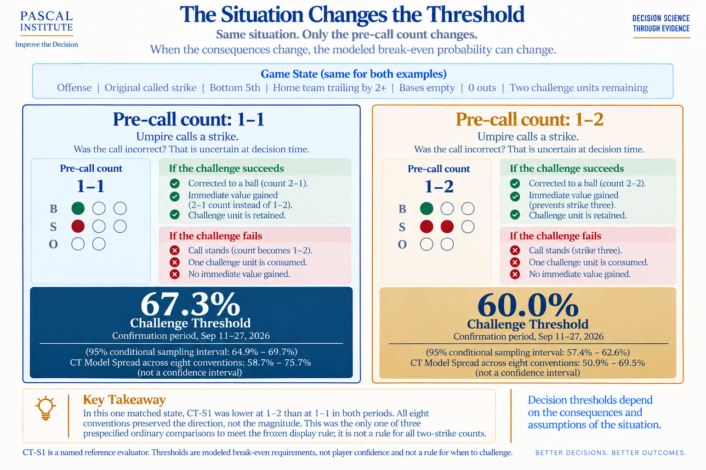
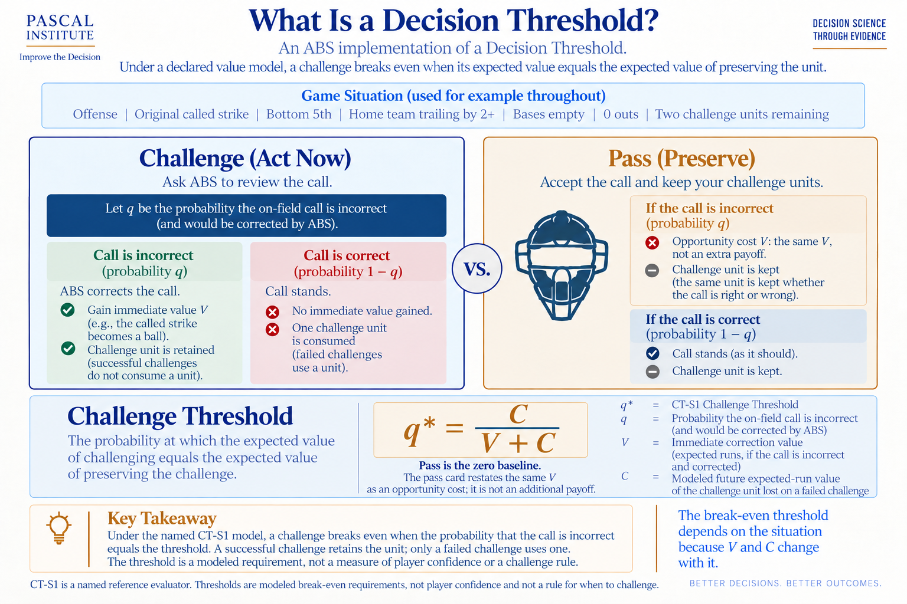
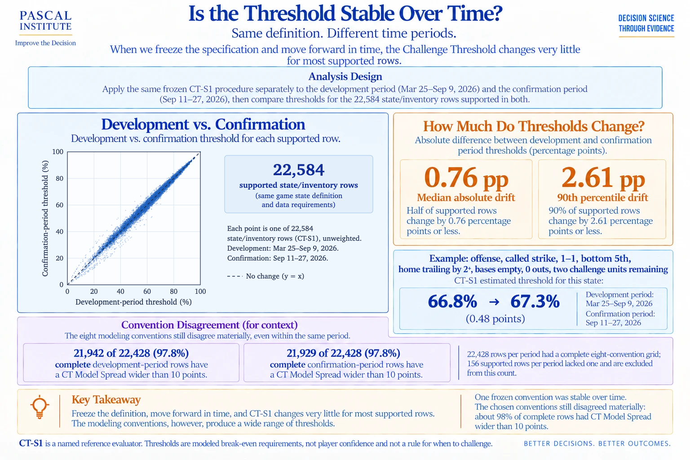
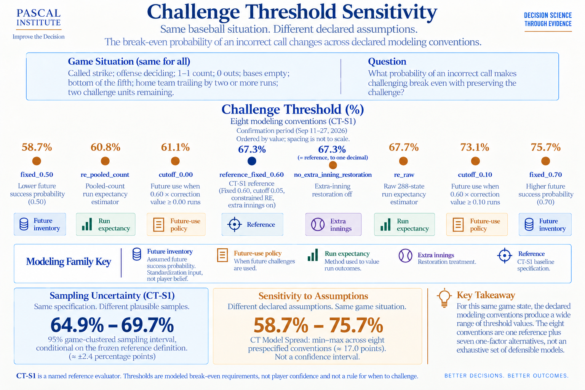

# Pricing an ABS Challenge

*Decision Thresholds Under Uncertainty in Major League Baseball*

**Subject:** MLB ABS Challenge System  
**Status:** Draft 3, September 2026  
**Data:** Development March 25 to September 9, 2026; confirmation September 11 to 27, 2026  
**Method:** Challenge Threshold (CT-S1) and Decision Opportunity Score  

A one-page research abstract is in [abstract.pdf](abstract.pdf). Methods and limits are in [methodology.md](methodology.md); the tables behind the figures are in [data/](data/).

---


Imagine the bottom of the fifth inning. The home team trails by at least two runs, nobody is on base, nobody is out, and the offense still has two challenges available. The umpire calls a strike. At a 1-1 count, the call moves the plate appearance to 1 ball 2 strikes. With a 1-2 count, the batter is 1 strike away from being retired, and that same batter has only a couple of seconds to decide whether he believes the umpire missed the pitch badly enough to ask the Automated Ball-Strike system to review the call.

There is a lot happening during those two seconds. The batter saw the pitch travel toward the plate and watched it enter the catcher's mitt. He has his own perception of the strike zone and may have a strong sense of whether the pitch crossed it. What he does not have is the answer. If he challenges and ABS determines the call was incorrect, the call is changed and the team keeps its challenge. If the call is confirmed, one of the team's challenge units is lost. If he chooses not to challenge, the unit is preserved for later, but a potentially incorrect call is allowed to stand.

In Article 4 of our ABS Challenge series, we looked at the cost of allowing an incorrect call to stand. Using estimated run value, we were able to measure what was lost when a call that could have been corrected was allowed to remain. That research showed that some missed opportunities carried very little cost, while others could materially change the expected run value of an inning. It also demonstrated why judging the decision by what happened several batters later can be misleading. The value of the decision existed at the moment the choice was made.

This time, we wanted to take the next step. If an incorrect call has a measurable cost, and a challenge has future value if it is preserved, there should be some point where the value available from correcting the current call becomes large enough to justify risking a challenge. The question was no longer simply what a missed challenge was worth. We wanted to know how strong the evidence needed to be before using one.

That question led us to Challenge Threshold.

## Putting a price on the decision

Every challenge decision places two values in competition. The first is the immediate value available if the call is incorrect and ABS corrects it. A hitter who had been called out may remain at the plate. A called strike may become a ball and move the count in the hitter's favor. On a defensive challenge, a called ball may become strike three and end the plate appearance. Each correction changes the game state, and we can estimate the value of that change using expected runs. We call this immediate correction value V.

The second value belongs to the challenge itself. A successful challenge is retained, but an unsuccessful challenge costs the team one of its limited challenge units. That unit may have value later in the game when another questionable call occurs, perhaps in a situation where correcting the call is worth considerably more. We call the modeled future expected-run value of the challenge that would be lost C.

Once both values are expressed on the same expected-run scale, a break-even point can be calculated:

```text
Challenge Threshold = C / (V + C)
```

If the decision-time probability that the on-field call is incorrect equals that threshold, the modeled expected value of challenging and preserving the unit is the same. If the probability rises above the threshold, the current opportunity becomes valuable enough under the model to justify risking the challenge. If it remains below the threshold, preserving the challenge has greater modeled value.



*Figure 1. Challenge Threshold balances immediate correction value against the future value of preserving the challenge.*

It is important to understand what Challenge Threshold does not tell us. A threshold of 67 percent does not mean the hitter was 67 percent confident the umpire missed the call. Public data cannot reproduce exactly what a hitter saw or how certain he felt during the two-second decision window. Instead, Challenge Threshold answers a narrower question: under a declared value model, what probability that the on-field call is incorrect would be required for challenging to break even?

For this study, we created a public reference called Challenge Threshold Standard 1, or CT-S1. The reference uses an expected-runs objective, a count-aware run-expectancy estimator, a standardized future challenge probability and a declared policy for determining when a future challenge would be used. These choices give CT-S1 a consistent definition that can be reproduced and tested. They do not make it the only reasonable way to value a challenge.

## From a threshold to an opportunity score

Challenge Threshold is useful mathematically, but the percentage creates two communication problems. First, a lower threshold represents a more favorable opportunity to act, which runs opposite to the way we normally read a score. A 34 percent threshold represents a more favorable challenge opportunity than an 86 percent threshold, even though the larger number looks more impressive. Second, presenting the result as a percentage invites a comparison with player confidence, even though CT-S1 does not measure what the player believed.

To make the opportunity easier to compare without changing the underlying model, we can invert the threshold and place it on a 0-to-100 scale. We call that transformation the Decision Opportunity Score, or DOS:

```text
Decision Opportunity Score = 100 × (1 − Challenge Threshold)
```

A Challenge Threshold of 67.3 percent therefore becomes a Decision Opportunity Score of 32.7. A threshold of 34.4 percent becomes a score of 65.6. Nothing about the underlying expected-run calculation has changed. DOS simply turns the scale around so higher values represent situations where the immediate correction opportunity is more favorable relative to preserving the challenge.

DOS is not a probability, and it is not a measurement of player confidence. It describes the opportunity created by the game situation under the declared model. The player still has to supply something the model cannot observe: the evidence available during those two seconds that the umpire's call may be incorrect.

That distinction gives us a useful way to think about the decision. Opportunity determines the bar. Evidence determines whether the player clears it.

## One situation, two different decisions

Return to the situation from the beginning. It is still the bottom of the fifth, the home team still trails by at least two runs, the bases are empty, nobody is out, and two challenges remain. The only thing we are going to change is the count.

With a 1-1 count, the umpire's called strike moves the plate appearance to 1-2. A successful challenge would change the count to 2-1. When we applied CT-S1 to the confirmation-period data, the Challenge Threshold for that situation was 67.3 percent, which corresponds to a Decision Opportunity Score of 32.7. Now begin with a 1-2 count instead. The called strike becomes strike three and ends the plate appearance, while a successful challenge changes the count to 2-2. Under CT-S1, the threshold falls to 60.0 percent and DOS rises to 40.0.

The reason for the difference can be seen inside the reference calculation. For these two matched states, the modeled future cost of losing the challenge is the same at 0.292 expected runs. The immediate correction value is not. At 1-1, correcting the call is worth 0.142 expected runs. At 1-2, that value increases to 0.194 because the correction prevents strike three and keeps the plate appearance alive. With more immediate value available and the same modeled cost of losing the challenge, the opportunity becomes more favorable.



*Figure 2. The existing CT-S1 graphic shows how one change in count alters the break-even threshold. In DOS terms, the same comparison is 32.7 versus 40.0.*

## Decision Opportunity Score across different situations

The two examples above show how the price of a challenge can change even when most of the game state remains the same, but the range across baseball is much wider. Across the qualified confirmation-period population, CT-S1 ranged from 1.4 percent to 94.1 percent, with a median of 63.2 percent. On the inverted DOS scale, those same values range from 98.6 down to 5.9, with a median opportunity score of 36.8.

To provide a broader picture, we selected ten representative situations from the confirmation period using the same reproducible procedure developed for the research. The examples were not chosen because they produced dramatic scores. They were selected across threshold bands while providing variation in count, outs, runners, inning, score, challenge inventory and whether the offense or defense was making the decision.

| Side | Situation | Count | What the call means | Ch. | CT-S1 | DOS | Spec. range |
|---|---|---|---|---|---|---|---|
| Defense | B2, tied, 2 out, 1st & 2nd | 2-2 | Ball → 3-2; overturn → strike three | 1 | 34.4% | 65.6 | 27.0–46.0% |
| Offense | T8, leading 2+, 1 out, runner on 1st | 2-0 | Strike → 2-1; overturn → 3-0 | 2 | 47.6% | 52.4 | 39.3–57.1% |
| Defense | B3, leading 1, 2 out, 2nd & 3rd | 0-1 | Ball → 1-1; overturn → 0-2 | 2 | 54.8% | 45.2 | 46.6–77.5% |
| Defense | T7, trailing 1, 1 out, runner on 2nd | 0-2 | Ball → 1-2; overturn → strike three | 2 | 59.7% | 40.3 | 52.0–68.0% |
| Offense | B5, trailing 2+, 0 out, empty | 1-2 | Called strike three | 2 | 60.0% | 40.0 | 50.9–69.5% |
| Offense | B5, trailing 2+, 1 out, loaded | 0-0 | Strike → 0-1; overturn → 1-0 | 2 | 65.4% | 34.6 | 57.1–75.9% |
| Offense | B5, trailing 2+, 0 out, empty | 1-1 | Strike → 1-2; overturn → 2-1 | 2 | 67.3% | 32.7 | 58.7–75.7% |
| Defense | T5, leading 2+, 1 out, 1st & 3rd | 1-0 | Ball → 2-0; overturn → 1-1 | 1 | 71.0% | 29.0 | 63.2–78.4% |
| Defense | T5, leading 2+, 0 out, runner on 3rd | 3-1 | Ball four; overturn → 3-2 | 1 | 74.9% | 25.1 | 62.0–90.5% |
| Defense | T9, trailing 2+, 2 out, 1st & 3rd | 2-1 | Ball → 3-1; overturn → 2-2 | 1 | 85.7% | 14.3 | 63.3–93.2% |

*Note: Confirmation period, September 11–27, 2026. CT-S1 is the break-even probability under the named reference model. DOS is 100 × (1 − CT-S1), is not a probability, and does not measure player confidence. The specification range is the minimum and maximum across eight selected modeling conventions and is not a confidence interval. Only the 1-1 and 1-2 states above form a qualified matched comparison.*

The table makes the direction of the score easier to see. The bottom-of-the-second defensive opportunity receives a DOS of 65.6, while the top-of-the-ninth example receives only 14.3. That does not mean the second inning is more important than the ninth inning in the traditional baseball sense. CT-S1 values expected runs, not win probability or game leverage, and the two states differ in several ways.

What the comparison does show is that the immediate correction opportunity in the first state is much larger relative to the modeled future value of the challenge being risked. If the call is actually incorrect and the player has enough evidence to act, the opportunity is favorable. The ninth-inning state sets a much higher bar. A player could still be justified in challenging if his evidence is strong enough, but the situation itself offers less immediate correction value relative to the challenge inventory at risk.

This is why DOS should not be read as a recommendation. A score of 66 does not say challenge. It says that, under CT-S1, the situation provides a relatively favorable opportunity to act if the player has evidence that the call is incorrect. A score of 14 says the opposite: the evidence needs to be considerably stronger before the opportunity clears the bar.

## Does the reference hold up over time?



*Figure 3. The frozen CT-S1 specification remained highly stable from development to confirmation. The same stability carries to DOS because DOS is a direct transformation of CT-S1.*

## When the definition changes

There is something reassuring about a number such as 67.3 percent, or a score such as 32.7. The decimal place creates an appearance of precision, and statistically the reference estimate is reasonably precise. That does not mean either number is an assumption-free truth.

CT-S1 contains several choices about how future challenge value should be measured. The reference standardizes future opportunities using a fixed 60 percent success probability, uses a 0.05 expected-run cutoff for future challenges, relies on a particular count-aware run-expectancy estimator and includes a defined extra-inning restoration rule. To determine how dependent Challenge Threshold was on those choices, we created seven alternative conventions that changed one modeling assumption at a time.

For the same 1-1 situation that produced the 67.3 percent reference threshold, lowering the standardized future probability from 60 percent to 50 percent reduced the threshold to 58.7 percent. Raising it to 70 percent increased the threshold to 75.7 percent. Changing the future-use cutoff produced thresholds of 61.1 and 73.1 percent, while changing the run-expectancy estimator produced 60.8 and 67.7 percent. Removing the extra-inning restoration rule had essentially no effect on this particular state.

Nothing about the baseball situation changed. What changed was how we chose to value the decision. On the DOS scale, the same sensitivity appears in reverse. A 58.7 percent threshold becomes a score of 41.3, while a 75.7 percent threshold becomes 24.3. The score is easier to read, but it cannot make the modeling assumptions disappear.

This sensitivity was not limited to the example. Among the 22,428 supported states where all eight conventions could be calculated, approximately 98 percent had a difference greater than 10 percentage points between the lowest and highest thresholds produced by those conventions.



*Figure 4. Challenge Threshold sensitivity for the 1-1 example. DOS does not remove this specification sensitivity; it only changes how the opportunity is presented.*

## Two different kinds of uncertainty

At first, the sensitivity result appears difficult to reconcile with the temporal test. One analysis tells us CT-S1 is extremely stable, while another tells us the threshold can move substantially. Both are true because they answer different questions. When the definition remains fixed and the data move forward in time, CT-S1 is stable. When the situation remains fixed and reasonable assumptions about how to value it are changed, the resulting threshold can move considerably.

The difference can be seen by returning to the 1-1 example. CT-S1 produced a confirmation-period threshold of 67.3 percent. Using 2,000 game-clustered replicates while keeping the CT-S1 definition unchanged, the 95 percent conditional sampling interval ran from approximately 64.9 to 69.7 percent. That interval describes uncertainty in estimating CT-S1 from the available sample while continuing to use the same model.

The eight-convention range of 58.7 to 75.7 percent describes something different. It shows how much the answer changed when selected assumptions used to define the threshold were changed. It is not a confidence interval, does not represent a probability distribution and should not be interpreted as containing some unknown true Challenge Threshold.

This distinction is important because a model can be estimated precisely without being the only reasonable model. CT-S1 can therefore be both stable and useful while remaining dependent on declared assumptions. DOS inherits exactly the same limitation. Rather than hiding that dependence, the reference should be named, its assumptions published and its versions preserved so future improvements can be compared against the same standard.

## Opportunity and evidence are not the same thing

Decision Opportunity Score gives us a more intuitive way to compare the situation, but it does not complete the decision. Consider the bottom-of-the-second example with a DOS of 65.6. The score is high because, under CT-S1, correcting the call would be valuable relative to the future challenge inventory at risk. If the player believes the umpire almost certainly made the correct call, however, there may still be no reason to challenge.

The reverse can also occur. The top-of-the-ninth example has a DOS of only 14.3. The situation places a high bar on using the challenge because the modeled immediate correction value is small relative to preserving the unit. A player who has exceptionally strong evidence that the call is incorrect may still clear that bar.

This separates two parts of the decision that are easy to blend together. DOS describes the opportunity created by the game state. The player supplies the evidence about whether the premise for acting is true. CT-S1 connects the two by identifying the break-even point. Opportunity determines the bar; evidence determines whether the player clears it.

Public data can model the first part much better than the second. We can estimate run values, future inventory cost and the threshold implied by those quantities. We cannot recreate exactly what the player saw, how the pitch appeared from his angle or how strongly he believed the call was incorrect during the two-second window. That is why DOS should be used to describe the opportunity rather than to grade the player.

## Reviewing the decision instead of the outcome

Once a player challenges a pitch, ABS quickly provides an answer. That makes it easy to judge the decision by what happened next. A successful challenge feels like a good decision, while a failed challenge feels like a mistake. The relationship between decision and outcome is not that simple.

Baseball players already understand this distinction in other parts of the game. A hitter can square up a pitch, drive the ball to the warning track and make an out. He can also get fooled, make poor contact and watch the ball fall safely between two fielders. Nobody evaluating those swings seriously would argue that the second was better simply because it produced a hit. Pitchers review pitch selection, location and execution in much the same way. The result matters, but it does not tell the entire story.

Challenge decisions can be reviewed using the same approach. After the game, a player can return to the video and reconsider what he saw during those two seconds. He can look at the location of the pitch, where the catcher received it with his mitt and any movement that may have influenced his perception. DOS provides a reference for the opportunity that existed at the time without pretending to know the player's confidence.

A player may discover that he challenges aggressively in low-scoring opportunities even when his evidence is weak. Another may find that he routinely passes on high-scoring opportunities because he demands more certainty than the situation requires. Over time, the player may also learn where his own perception is reliable and where it is not. The score cannot provide those answers by itself, but it gives the review a consistent starting point.

The goal is not to look backward and assign blame every time a challenge fails. It is to learn enough from one decision to improve the next.

## From Challenge Threshold to Decision Threshold

When we began this research, our objective was fairly narrow. We wanted to determine whether the value of an ABS challenge could be measured in a way that accounted for both the immediate benefit of correcting a call and the future cost of losing a challenge. Challenge Threshold gave us the break-even point. Decision Opportunity Score gave us a more intuitive way to describe the opportunity created by that threshold.

As the analysis developed, the structure of the problem began to look less specific to baseball. The player has incomplete information and must decide whether the evidence is strong enough to act. Acting can produce immediate value, but acting incorrectly carries a cost. Choosing not to act preserves a resource for another opportunity, although the value of that future opportunity is uncertain. The decision must be made before the uncertainty is resolved.

Those characteristics appear in many decisions. A bettor compares an estimated probability with a market price while deciding whether the potential edge is large enough to risk limited capital. An investor weighs expected return against risk and the opportunity cost of committing money that could be used elsewhere. The details and equations differ, but the structure is recognizable: evidence, opportunity, uncertainty and a point where the balance changes.

We call that broader point a Decision Threshold. Challenge Threshold is a concrete baseball implementation. Decision Opportunity Score is a way to express the opportunity side of that decision on a common 0-to-100 scale, where higher values indicate that acting is more favorable relative to preserving the alternative under the declared model.

That does not mean a DOS of 70 in baseball is automatically equivalent to a score of 70 in investing or wagering. A common scale does not create comparability unless the underlying models support it. The value of the idea is more basic: separate the opportunity from the evidence, make the assumptions explicit and identify the point at which the available evidence becomes strong enough to justify action.

## Improving the decision

CT-S1 is only a first reference, and DOS is only a presentation of that reference. Neither provides a universal challenge playbook. CT-S1 measures expected runs rather than win probability, and the specification analysis shows that other reasonable assumptions can produce different break-even points. The model also cannot observe the player's decision-time evidence.

What the framework does provide is a consistent way to price the situation. We can calculate the immediate expected-run value available from correcting a call, estimate the future value placed at risk when an unsuccessful challenge consumes a unit, state the assumptions used to put those values onto the same scale and test whether the resulting reference remains stable as new data arrive.

That creates a foundation for the next questions. We can begin asking whether players consistently select higher-value opportunities, how much expected-run value successful challenges capture, how much future challenge value is lost on unsuccessful attempts and how those measures change the way we view traditional challenge leaderboards. Those questions require additional research, and they should not be answered by stretching CT-S1 beyond what this study established.

For now, the most practical use may be simpler. During a game, DOS provides a way to describe how favorable a challenge opportunity is under the reference model. After the game, it provides a way to revisit the opportunity without allowing the final ruling to rewrite what was knowable when the player had to decide. The player can compare the situation with the evidence he remembers having and decide whether the process is something he would repeat.

That process is at the heart of what we mean by Decision Science. The objective is not to remove uncertainty before making a choice. In most meaningful decisions, that is impossible. The objective is to understand the opportunity, evaluate the evidence available at the time, make the best decision possible under those conditions and then use the outcome as new information for the next decision.

An ABS challenge provides an unusually clean place to see that process unfold. The player has only two seconds, the resource is limited and the answer arrives almost immediately. Yet the question being asked is larger than whether one pitch was a ball or a strike.

It is the question behind every Decision Threshold: How strong does the evidence need to be before the opportunity is worth acting on?
